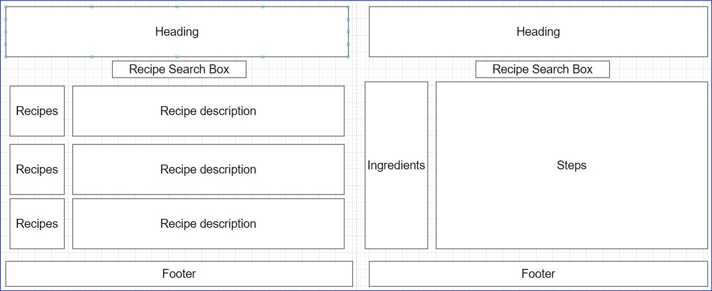

<a name="readme-top"></a>

# project1-grp3

## Description


## User Story

```
GIVEN I am wanting to decide on a meal to cook
I WANT to be able to quickly and easily find a recipe
SO THAT I can prepare a meal I would enjoy

```
<p align="right">(<a href="#readme-top">back to top</a>)</p>

## User Acceptance Criteria

```
WHEN I load the page
THEN I want to be able to search for a recipe

WHEN search results for recipes are shown
THEN a summary of information relating to the recipe is presented to the user - serves, prep time, rating, cook time

WHEN a recipe is clicked
THEN the user is taken to a recipe page that details cooking steps, ingredients

WHEN I leave the site and return
THEN I can access my past searches


```
<p align="right">(<a href="#readme-top">back to top</a>)</p>

## Screenshot

Wireframe 



The below is a screenshot of the web application's appearance


<p align="right">(<a href="#readme-top">back to top</a>)</p>

## Installation

Cloning the repo is the only step required.

<p align="right">(<a href="#readme-top">back to top</a>)</p>


## Usage
<a name="URL"></a>
Link to deployed website is found here:
 []

  
index.html, script.js and style.css files can be opened in Visual Studio Code

<p align="right">(<a href="#readme-top">back to top</a>)</p>
 

## Credits
Othneildrew - for the example on linking back to the top of the readme page!

<p align="right">(<a href="#readme-top">back to top</a>)</p>

## License

Please refer to the LICENSE in the repo.
<p align="right">(<a href="#readme-top">back to top</a>)</p>

## Badges

N/A
<p align="right">(<a href="#readme-top">back to top</a>)</p>

## Features


<p align="right">(<a href="#readme-top">back to top</a>)</p>

## How to Contribute

N/A
<p align="right">(<a href="#readme-top">back to top</a>)</p>

## Tests

### Application specific:
* Validate that the ... when 
*
### Developer practice tests:
* Validate that the application deployed at the live URL (<a href="#URL">Navigate to URL</a>)
* Validate that the webpage loaded without errors
* Validate that GitHub URL has been submitted
* Validate that GitHub repository contains application code
* Validate that the application resembles mock-up provided in the challenge instructions
* Validate that the GitHub repository has a unique name
* Validate that the GitHub repostiory followed be practice for class/id naming conventions, indentation, quality comments, etc
* Validate that the repository contains multiple descriptive commit messages
* Validate that the repository contains a quality README file with description, screenshot and link to deployed applications

<p align="right">(<a href="#readme-top">back to top</a>)</p>

